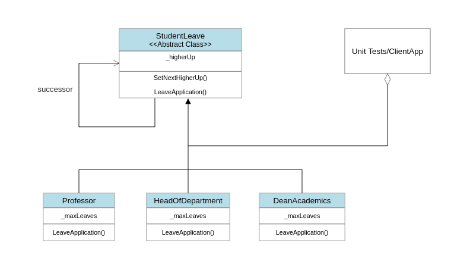

# Overview
**Software design patterns** are programming paradigms that describe reusable patterns for common design problems. They are a set of tried and tested solutions to common problems in software design. They are not algorithms or code snippets that can be copied and pasted into your code. They are more like templates that can be applied to different situations. They are not a substitute for good software design principles, but they are a good starting point for designing your software. They are a good way to document your design decisions. They are a good way to communicate your design to other developers.

**Chain Of Responsibility design pattern** is demonstrated in this project. The Chain Of Responsibility pattern is a behavioural design. According to the Gang of Four Definitions, the Chain of Responsibility Design Pattern states that Avoid coupling the sender of a request to its receiver by giving more than one receiver object a chance to handle the request. Chain the receiving objects and pass the request along until an object handles it. In simple words, the chain of responsibility design pattern creates a chain of receiver objects for a given request. In this design pattern, normally, each receiver contains a reference to another receiver. If one receiver cannot handle the request, it passes the same request to the following receiver, and so on. One receiver handles the request in the chain, or one or more receivers handles the request. 

# Design
This project defines a student leave application handler. The handler notes down the student's name and no of days of leave requested. The handler either approves the request or passes it to the following handler in the chain. The request is suspended if the request cannot be processed by the last handler of the chain. Here, Professor, HeadOfDepartment and DeanAcademics are the handlers in order in the chain.

# Environment
The project builds and runs with Visual Studio Community 2022 when the required workloads are installed.
